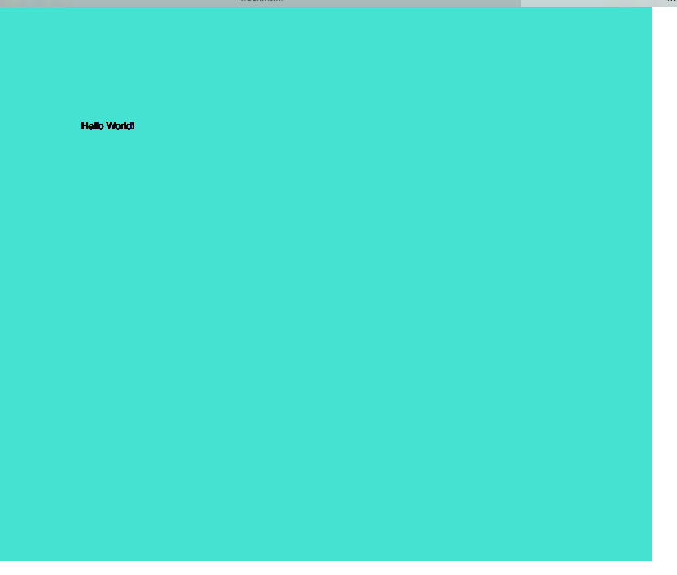

Mark Lannen, 50

["Hello World!"](https://marklannenum.github.io/work-120/hw-03/)

# HW-03 Responses

I enjoyed this week. It was very useful to spend time using atom and github as I am getting more familiar with them and am starting to be able to intuit my way aroung them a bit. I still need to reference the course and online material regularly in order to understand what I am doing and getting them to do what I want.

I also tried to use the command line in terminal as much as possible in order to carry on familiarizing myself with that technology. I can't say I'm proficient at it yet, and I still get a bit lost when navigating through directories and making and deleting new ones, but I would say that I am getting a little less lost than I had been the first two weeks.

It was great to actually make a first sketch. The biggest priority for me was to really understand the syntax that was introduced this week and make sure I could create a canvas and draw some text from scratch without having to look at the documentation. I spent some time looking at the p5 reference page on colors and experimented with using rgb codes to change the background.

Most of the 'issues' I had this week related to mistakes made when manually typing the code into atom and leaving out quotation marks, forgetting to put them in, or some other syntactic error that prevented the code from working how I thought it should. I tried to not get frustrated and just remind myself that computers are ruthlessly logical machines and that if I just carefully examined what I had done, I would find a completely reasonable explanation as to why the code wasn't working.

The only other issue I came across was that I renamed the howework directory on atom from hw-03 to hw-3 to be consistent with last week's directory name. I then spent some time trying to work out why none of my changes were being reflected in my repository. Helpfully, github desktop actually gives an error message when it can't find the files. I eventually just changed the directory name back to what it had been and it is working fine now.
