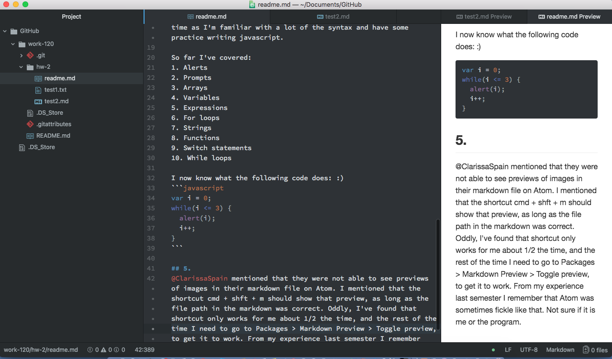

 # Mark Lannen
 ## 1.
 I went through all of the Github, Github desktop and Atom setup steps line by line. I know there were options at some stages to use a different text editor and GUI application, but I went with what was recommended as I don't want to spend any extra mental effort learning something that most people in the class likely weren't going to use.
 ## 2.
 I did my best to use the terminal command line whenever I could to complete the assignments as I am completely new to that and could use the practice. I more or less have a handle on the syntax and the commands, but what I find really challenging about working with the command line is that it is hard for me to visualize where I am in a directory. At the moment I still find it much easier to work using the traditional method with a mousepad.
 ## 3.
 I didn't have any particular problems completing the assignments. I'm somewhat familiar with Atom and Github, though I suppose that the only 'issue' I had was that it definitely takes me longer to set up/navigate around a directory using the terminal command line. I'll need to be convinced by experience that it really is a more efficent way of working. I have to admit to being sceptical, but am keeping an open mind. :)

 I added a question on using 2 different computers to access and edit the same git repo. @michaelmusick gave helpful instructions which I will try to follow tomorrow.

## 4.
I would be interested in hearing from the instructors why in their experience using the terminal is better than the mouse, or if they had similar difficulties at first understanding exactly where they were and what they were doing when navigating and setting up directories with the terminal. For me to really learn a new technology I have to:
- Understand the 'big picture' and see how it fits into getting a task done.
- Use it repeatedly, as that is the best way for me to absorb the detailed knowledge that I need to make something work.
- Both of these were essential for me when learning HTML and CSS.

Re: anything I'd like discuss further - I'm looking forward to starting the actual coding. I'm completely new to coding, and was worried that this class was going to be a struggle for me, so over the winter break I downloaded a book called *"A Smarter Way to Learn Javascript."*  [This is the Amazon page.](https://www.amazon.com/Smarter-Way-Learn-JavaScript-technology-ebook/dp/B00H1W9I6C) The book contains 89 chapters. Each is very short and is accompanied by a web page with 20 coding exercises for each chapter. [This page is the beginning of the exercises.](https://www.amazon.com/Smarter-Way-Learn-JavaScript-technology-ebook/dp/B00H1W9I6C)
I made it through about half the book and am glad I've put in the time as I'm now somewhat familiar with a lot of the syntax and have some practice writing javascript.

So far I've covered:
1. Alerts
2. Prompts
3. Arrays
4. Variables
5. Expressions
6. For loops
7. Strings
8. Functions
9. Switch statements
10. While loops

I now know what the following code does:  :)
```javascript
var i = 0;
while(i < 5) {
  alert(i);
  i++;
}
```

## 5.
@ClarissaSpain mentioned that they were not able to see previews of images in their markdown file on Atom. I mentioned that the shortcut cmd + shft + m should show that preview, as long as the file path in the markdown was correct. Oddly, I've found that shortcut only works for me about 1/2 the time, and the rest of the time I need to go to Packages > Markdown Preview > Toggle preview, to get it to work. From my experience last semester I remember that Atom was sometimes fickle like that. Not sure if it is me or the program.

## Screenshot of editor

